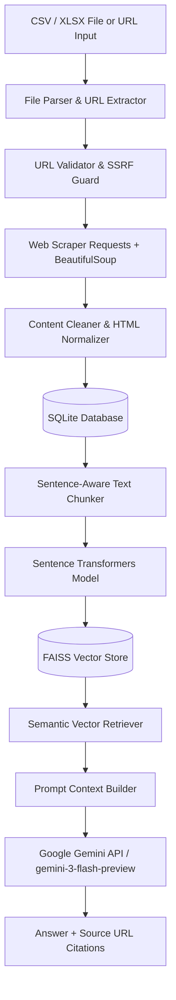

# Knowledge Base Hub & Local RAG Platform (Task 1)

A production-grade, end-to-end Knowledge Base & Retrieval-Augmented Generation (RAG) platform built with Django. This system features automated web scraping, HTML content cleaning, sentence-aware text chunking, FAISS vector indexing, semantic vector search, grounded LLM answer synthesis with clickable source citations, and REST APIs.

---

## System Architecture



---

## Technologies & Stack

| Layer | Technology |
|---|---|
| **Backend Framework** | Django 4.2+, Django REST Framework |
| **Database** | SQLite 3 |
| **Web Scraping** | Requests, BeautifulSoup4, Pandas, OpenPyXL |
| **Embeddings** | SentenceTransformers (`all-MiniLM-L6-v2`, 384d) |
| **Vector Database** | FAISS CPU (`IndexFlatIP` with L2 Normalization) |
| **LLM Provider** | Google Gemini API (`gemini-3-flash-preview`) |
| **Frontend** | HTML5, CSS3, Vanilla JavaScript, Bootstrap 5 |

---

## Core Features

- **Automated CSV/Excel & URL Ingestion**: Bulk extract and validate URLs from uploaded spreadsheets or single URL inputs.
- **Web Scraping & Content Cleaning**: Extract main content, titles, meta descriptions, and strip boilerplate scripts/navbars with SHA256 content deduplication.
- **Sentence-Aware Text Chunking**: Splits harvested text into 700-character chunks with 100-character sentence overlap.
- **FAISS Vector Indexing**: High-speed inner product vector search with metadata mapping.
- **Grounded Semantic QA**: RAG search querying FAISS to assemble context snippets and generate accurate answers with exact clickable source URL references.
- **RESTful API**: Full REST endpoints for URL document management, file uploads, and RAG search.

---

## Development Time

**Total Development Time: 5.0 Hours**

| Activity | Time Spent |
|---|---:|
| System Architecture & Django Setup | 0.5 hours |
| Database Schema & Data Models | 0.5 hours |
| Spreadsheet Parser & URL Validation Pipeline | 0.5 hours |
| Web Scraper & HTML Cleaning Pipeline | 1.0 hours |
| Text Chunker & FAISS Vector Indexing | 1.0 hours |
| Semantic RAG Search & LLM Integration | 0.5 hours |
| Web Dashboard UI & REST API Endpoints | 0.5 hours |
| Automated Testing, Logging & Documentation | 0.5 hours |
| **Total** | **5.0 hours** |

---

## Setup & Execution

### 1. Clone & Setup Environment
```bash
git clone https://github.com/Durai-Kannan/Knowledge-Base.git
cd "Task 1"

# Create virtual environment
python -m venv venv

# Activate virtual environment (Windows)
venv\Scripts\activate

# Install dependencies
pip install -r requirements.txt
```

### 2. Configure Environment Variables
Copy `.env.example` to `.env` and fill in your Gemini API key:
```bash
cp .env.example .env
```

### 3. Database Migration & Web Server
```bash
python manage.py migrate
python manage.py runserver
```
Access the application UI at `http://127.0.0.1:8000/`

---

## Management Commands

### Ingest URLs from File or URL
```bash
# Ingest URLs from CSV/XLSX spreadsheet
python manage.py ingest_urls --file "Leadership URL.xlsx"

# Ingest single URL
python manage.py ingest_urls --url "https://example.com/leadership"
```

### Regenerate FAISS Vector Index
To rebuild the FAISS vector index locally from SQLite harvested content:
```bash
python manage.py build_vector_index
```

---

## REST API Endpoints

- `GET /api/urls/` - List all harvested URL documents with pagination and filter status.
- `GET /api/urls/<id>/` - Retrieve complete document details including extracted chunks and metadata.
- `POST /api/upload/` - Upload a CSV/XLSX file to trigger URL extraction and ingestion.
- `POST /api/search/` - Execute semantic vector search and return synthesized LLM answer with source citations.

---

## Automated Testing & Logging

### Running Unit Tests
```bash
pytest
```

### Logging Configuration
Logs are written in structured format to both stdout console and persistent `app.log` file covering ingestion progress, scraping status codes, chunk indexing, and search execution.

---

## Screenshots & Artifacts Structure

```text
screenshots/
├── 01-dashboard.png        # Total URLs, success/failed metrics, indexed chunks
├── 02-csv-upload.png       # CSV file selector and batch processing status
├── 03-harvested-urls.png   # URL table, HTTP status codes, titles
├── 04-semantic-search.png  # Natural language query, answer, clickable source links
└── 05-rest-api.png         # GET /api/urls/ JSON REST API output
```

---

## Questions & Assumptions

1. **URL Format**: The input CSV or XLSX spreadsheet contains HTTP/HTTPS web links.
2. **HTML Extraction**: Webpages are scraped for static content using BeautifulSoup.
3. **Database Selection**: SQLite is selected for zero-configuration, lightweight local deployment.
4. **FAISS Vector Database**: `faiss-cpu` is used locally without requiring external cloud vector services.

---

## Difficulties Encountered

- **HTTP Status Errors**: Handled scraping blocks (403/429) using custom User-Agent headers and exception tracking in SQLite.
- **HTML Boilerplate Removal**: Cleaned headers, footers, navigation bars, and script tags to retain pure body content.
- **FAISS Metadata Sync**: Synchronized FAISS vector position index IDs with SQLite document chunk records.

---

## Key Observations

- FAISS provides lightweight, high-performance vector retrieval on local hardware.
- Sentence-aware chunking ensures query retrieval accurately targets relevant sections of web pages.
- Persistent SQLite storage enables full auditing and tracking of harvested URLs.

---

## License

MIT License. See [LICENSE](LICENSE) for details.
