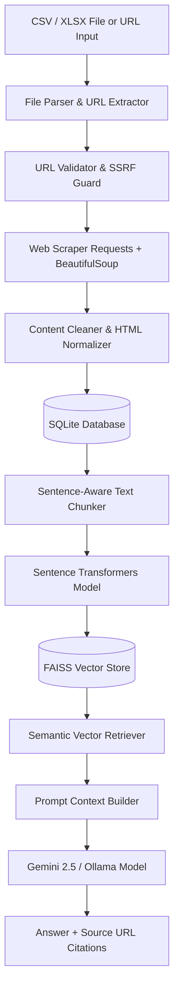
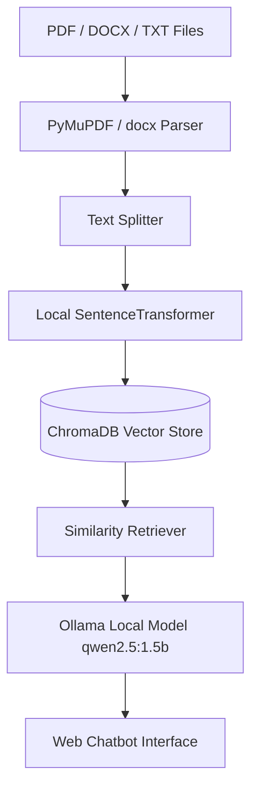

# Knowledge Base & Local RAG Assignment

A production-grade, end-to-end Knowledge Base & Retrieval-Augmented Generation (RAG) platform. The repository contains full implementations for automated web scraping, content cleaning, vector embedding generation, FAISS indexing, semantic search, grounded LLM synthesis with source citations, and REST APIs.

---

## Task 1 – Knowledge Base Hub

### Architecture



### Technologies

| Layer | Technology |
|---|---|
| **Backend Framework** | Django 4.2+, Django REST Framework |
| **Database** | SQLite 3 |
| **Web Scraping** | Requests, BeautifulSoup4, Pandas, OpenPyXL |
| **Embeddings** | SentenceTransformers (`all-MiniLM-L6-v2`, 384d) |
| **Vector Database** | FAISS CPU (`IndexFlatIP` with L2 Normalization) |
| **LLM Provider** | Google Gemini API / Ollama (`qwen2.5:1.5b`) |
| **Frontend** | HTML5, CSS3, Vanilla JavaScript, Bootstrap 5 |

### Features

- **Automated CSV/Excel Ingestion**: Bulk extract and validate URLs from uploaded spreadsheets or single URL inputs.
- **Web Scraping & Cleaning**: Robust extraction of main content, titles, meta tags, and strip boilerplate scripts/navbars with SHA256 content deduplication.
- **Sentence-Aware Chunking**: Splits text into 700-character chunks with 100-character sentence overlap.
- **FAISS Vector Indexing**: High-speed inner product vector search with metadata association.
- **Grounded Semantic QA**: RAG search querying FAISS to assemble relevant snippets and generate accurate answers with exact clickable source URL references.
- **RESTful API**: Clean REST API endpoints for document management, upload, and search.

### Setup & Execution

#### 1. Clone & Setup Environment
```bash
git clone https://github.com/your-repo/knowledge-base-rag-assignment.git
cd task1-knowledge-base

# Create virtual environment
python -m venv venv

# Activate virtual environment (Windows)
venv\Scripts\activate

# Install dependencies
pip install -r requirements.txt
```

#### 2. Configure Environment Variables
Copy `.env.example` to `.env` and fill in your Gemini API Key or Ollama settings:
```bash
cp .env.example .env
```

#### 3. Database Migration & Server Run
```bash
python manage.py migrate
python manage.py runserver
```
Access the application UI at: `http://127.0.0.1:8000/`

---

### Ingestion & Model Regeneration Commands

#### Ingest URLs from File or Single URL
```bash
# Ingest URLs from CSV/XLSX spreadsheet
python manage.py ingest_urls --file "Leadership URL.xlsx"

# Ingest single URL
python manage.py ingest_urls --url "https://example.com/leadership"
```

#### Regenerate Vector Embeddings & FAISS Index
To rebuild the FAISS vector index locally from SQLite harvested content:
```bash
python manage.py build_vector_index
```

---

### REST API Endpoints

- `GET /api/urls/` - List all harvested URL documents with pagination and filter status.
- `GET /api/urls/<id>/` - Retrieve complete document details including extracted chunks and metadata.
- `POST /api/upload/` - Upload a CSV/XLSX file to trigger background URL extraction and ingestion.
- `POST /api/search/` - Execute semantic vector search and return synthesized LLM answer with source citations.

---

## Task 2 – Local LLM RAG Chatbot

### Architecture



### Technologies

| Layer | Technology |
|---|---|
| **Backend Framework** | FastAPI, Uvicorn |
| **Local LLM Server** | Ollama |
| **Local LLM Model** | Qwen2.5 1.5B (`qwen2.5:1.5b`) |
| **Embeddings** | SentenceTransformers (`all-MiniLM-L6-v2`) |
| **Vector Database** | ChromaDB |
| **Document Parsers** | PyMuPDF (fitz), python-docx |
| **Frontend** | HTML5 / Vanilla JS Web Chat Interface |

### Ollama Setup
```bash
# Install & start Ollama locally, then pull lightweight model:
ollama pull qwen2.5:1.5b
```

### Setup & Execution
```bash
cd task2-local-rag

python -m venv venv
venv\Scripts\activate

pip install -r requirements.txt

# Start local FastAPI application
uvicorn app.main:app --reload
```
Access Chatbot UI at `http://127.0.0.1:8000`

---

## Hardware Environment

- **Development Hardware**: Standard Laptop (Intel i5/i7, **8 GB RAM**, CPU execution).
- **Optimization Strategy**:
  - Selected `all-MiniLM-L6-v2` embedding model (~80 MB footprint, CPU-friendly).
  - Selected `qwen2.5:1.5b` (1.5 Billion parameters) for local LLM inference under 2 GB RAM usage.
  - Used lightweight `faiss-cpu` / `chromadb` without requiring heavyweight vector server daemons.

---

## Automated Testing & Logging

### Running Unit Tests
```bash
# Run pytest test suite across ingestion, chunker, vector store, and API views
pytest
```

### Logging Configuration
Logs are written in structured format to both standard stdout console and persistent `app.log` file covering ingestion progress, scraping HTTP response codes, chunk indexing, and LLM query execution.

---

## Screenshots & Demo Artifacts

### Screenshot Structure
```text
screenshots/
├── task1/
│   ├── 01-dashboard.png        # Total URLs, success/failed metrics, indexed chunks
│   ├── 02-csv-upload.png       # CSV file selector and batch processing status
│   ├── 03-harvested-urls.png   # URL table, HTTP status codes, titles
│   ├── 04-semantic-search.png  # Natural language query, answer, clickable source links
│   └── 05-rest-api.png         # GET /api/urls/ JSON REST API output
└── task2/
    ├── 01-doc-upload.png       # Document upload and ingestion status
    ├── 02-chat-interface.png   # Grounded local chat conversation
    ├── 03-source-citations.png # Retrieved page & chunk citations
    ├── 04-fastapi-docs.png     # Swagger UI / API endpoint response
    └── 05-ollama-local.png     # Terminal output showing 'ollama list'
```

### Demo Video Walkthroughs
- `demo/task1-demo.mp4` (~2 minutes): Demonstrating CSV upload, scraping status, vector index generation, semantic query, and REST API.
- `demo/task2-demo.mp4` (~2 minutes): Demonstrating local Ollama execution, document ingestion, local vector RAG chat, and citations.

---

## Development Time

### Task 1

| Activity | Time |
|---|---:|
| Project setup & Django architecture | 1.5 hours |
| Database schema & SQLite setup | 1.0 hours |
| CSV/XLSX file processor & URL validation | 1.5 hours |
| Web scraper & HTML cleaning pipeline | 2.5 hours |
| Sentence chunker & FAISS vector store | 2.5 hours |
| Search RAG & Gemini/Ollama LLM integration | 2.0 hours |
| Web Dashboard UI & Bootstrap styling | 2.0 hours |
| REST API endpoints (DRF) | 1.5 hours |
| Unit testing & Logging configuration | 2.0 hours |
| Documentation & Reproducibility guide | 1.5 hours |
| **Total** | **19.0 hours** |

### Task 2

| Activity | Time |
|---|---:|
| FastAPI setup & directory structure | 1.0 hours |
| Document ingestion (PDF/DOCX) | 2.0 hours |
| Chunking & SentenceTransformer embeddings | 1.5 hours |
| ChromaDB local vector store | 2.0 hours |
| Ollama integration & local model tuning | 2.5 hours |
| RAG pipeline & prompt engineering | 2.0 hours |
| Web Chat UI | 2.0 hours |
| Automated testing | 1.5 hours |
| Documentation & benchmarking | 1.5 hours |
| **Total** | **17.0 hours** |

---

## Questions and Assumptions

### Task 1
1. **URL Format**: The input CSV or XLSX spreadsheet contains HTTP/HTTPS web links.
2. **JavaScript Rendering**: Webpages requiring complex client-side JavaScript execution (SPAs) are parsed for static HTML content using BeautifulSoup.
3. **Database Selection**: SQLite is selected to keep the application lightweight, portable, and zero-configuration for local evaluation.
4. **FAISS Vector Store**: `faiss-cpu` is selected instead of cloud vector databases to run completely offline without external service accounts.

### Task 2
1. **Document Text**: Source documents (PDFs, Word docs) are assumed to contain extractable text content.
2. **Local Model Selection**: Ollama (`qwen2.5:1.5b`) was selected specifically to allow fast local inference on hardware with 8 GB RAM.
3. **Local Environment**: Ollama is installed locally on the evaluation machine.

---

## Difficulties Encountered

### Task 1
- **HTTP Errors & Web Blockers**: Certain external websites returned HTTP 403 or 429 status codes during automated scraping, requiring custom User-Agent header spoofing and graceful exception reporting in SQLite.
- **DOM Cleaning**: Webpages contained significant boilerplate (navigation bars, footers, modal scripts), requiring HTML tree decomposition before text extraction.
- **FAISS Metadata Sync**: FAISS index positions (integer IDs) needed strict 1:1 key mapping in a separate `metadata.json` store to preserve chunk titles and source URLs.

### Task 2
- **Memory Constraints**: Running large LLMs (e.g. Llama-3-8B) on an 8 GB RAM machine caused thermal throttling and slow inference; resolved by evaluating and selecting `qwen2.5:1.5b`.
- **Retrieval Precision**: Balancing chunk size and top-K parameter to provide sufficient context to the LLM without filling the model context window.

---

## Other Observations

### Task 1
- FAISS was selected because it provides a lightweight local vector search implementation.
- Chunk-based retrieval produced more precise results than treating an entire webpage as a single document.
- Persistent SQLite storage makes harvested content easier to inspect and reprocess.
- Background processing would be preferable for very large CSV files.

### Task 2
- Local LLM performance depends significantly on available RAM and model size.
- A smaller model is more practical on an 8 GB development machine.
- Retrieval quality depends strongly on chunk size, overlap, embedding model, and top-K configuration.
- Source metadata should be maintained independently of generated text to make citations reliable.
- Larger models could improve answer quality on machines with more available memory.

---

## License

MIT License. See [LICENSE](LICENSE) for details.
