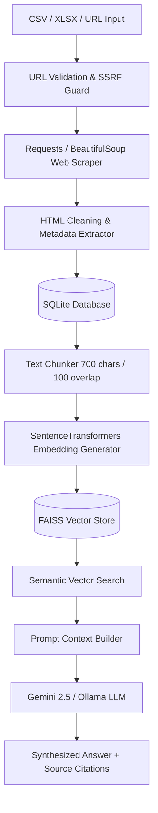

# System Architecture & Technical Specifications

## Overview

The **Knowledge Base Hub & RAG Pipeline** is designed as a modular, end-to-end web scraping, vector storage, and semantic question-answering application.

## System Components

### 1. Ingestion Pipeline
- **URL Validator**: Parses and verifies scheme syntax (`http`, `https`) and enforces SSRF protection against private IP ranges (`127.0.0.1`, `10.0.0.0/8`, `192.168.0.0/16`, `localhost`).
- **Web Scraper**: Executes HTTP GET requests with custom User-Agent headers, timeout handling, and status code verification.
- **Content Cleaner**: Decomposes boilerplate navigation, footers, script tags, and non-content elements. Extracts `title`, `meta description`, `language`, and computes SHA256 content hashes to detect duplicate content.
- **Text Chunker**: Splits cleaned body text into overlapping text segments (default: 700 characters with 100 character overlap) while preserving sentence boundary integrity.

### 2. Relational & Vector Storage Layer
- **SQLite Database**: Stores full raw HTML, metadata, cleaned text, scraping status, HTTP status codes, and individual document chunks with relational foreign keys.
- **FAISS Vector Store**: Employs Inner Product / Cosine Similarity indexing (`IndexFlatIP`) with L2 normalized vector embeddings (384 dimensions via `all-MiniLM-L6-v2`) and metadata mapping (`metadata.json`).

### 3. Retrieval-Augmented Generation (RAG) & LLM Synthesis
- **Vector Retrieval**: Measures inner-product similarity scores against query embeddings, filtering results above a configurable score threshold (default: 0.25).
- **Prompt Engineering**: Constructs strict context prompts forcing the LLM to answer strictly from retrieved webpage snippets with exact source URLs.
- **LLM Integration**: Interfaces with Google Gemini API (`gemini-2.5-flash`) or local Ollama endpoints (`qwen2.5:1.5b`).
